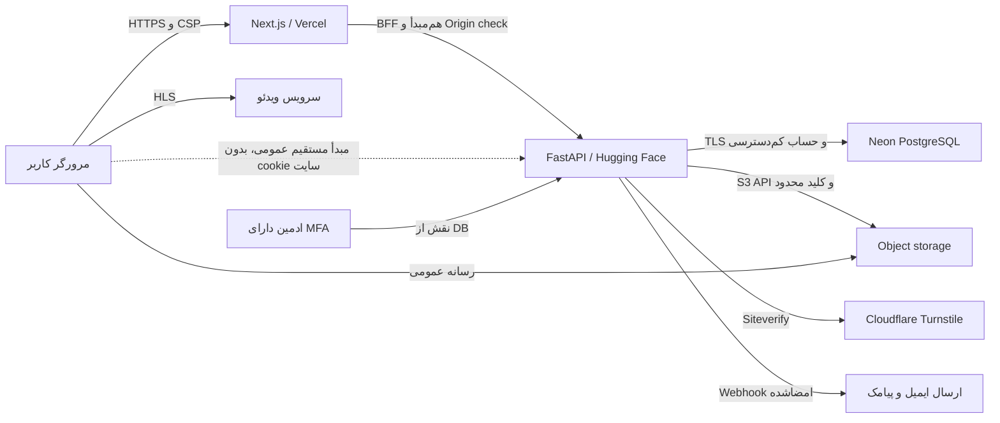

# مدل تهدید فاز ۳: امنیت و اعتماد

تاریخ بازبینی: ۱۰ مرداد ۱۴۰۵، برابر با ۱ اوت ۲۰۲۶

## هدف و دامنه

این مدل تهدید مسیرهای ثبت‌نام و ورود، تأیید ایمیل و موبایل، بازیابی رمز، نشست،
MFA، نقش‌های مدیریتی، API عمومی و خصوصی، آپلود فایل، پیام و جامعه، گزارش و
moderation و اسناد حقوقی چین‌ورس را پوشش می‌دهد.

اجزای داخل دامنه:

- Next.js frontend و پراکسی هم‌مبدأ `/api/backend`
- FastAPI backend و endpoint عمومی آن
- PostgreSQL/Neon و migrationهای Alembic
- object storage و سرویس پخش ویدئو
- Cloudflare Turnstile
- adapter ارسال ایمیل و پیامک
- مرورگر Android، iOS و desktop

زیرساخت داخلی ارائه‌دهندگان، دستگاه آلوده کاربر و امنیت حساب‌های مدیریتی
Vercel، Hugging Face، Neon و Cloudflare خارج از کنترل مستقیم کد هستند، اما
ریسک وابستگی آن‌ها در این سند لحاظ شده است.

## دارایی‌های حساس

1. رمز هش‌شده، refresh token، access token، secret رمزگذاری‌شده MFA و کدهای بازیابی
2. ایمیل، موبایل، پیام مستقیم، رزومه، اطلاعات پروفایل و درخواست پشتیبانی
3. محتوای عمومی و فایل‌های کاربران
4. نقش، وضعیت حساب، گزارش‌ها، یادداشت داخلی moderator و audit trail
5. داده یادگیری، تنظیمات و تعامل کاربران
6. کلیدهای deployment، دیتابیس، storage، Turnstile، MFA و delivery webhook
7. دسترس‌پذیری API، دیتابیس، فایل و ویدئو

## بازیگران و توان مهاجم

- بازدیدکننده ناشناس با امکان ارسال مستقیم درخواست به frontend یا backend
- کاربر عادی یا کاربر تعلیق‌شده با حساب معتبر
- مهاجم دارای رمز لو رفته یا refresh token سرقت‌شده
- ارسال‌کننده اسپم و ربات توزیع‌شده
- کاربر مخرب با فایل جعلی، metadata خصوصی یا محتوای آزاردهنده
- moderator کنجکاو یا مخرب
- ادمین یا حساب زیرساختی compromise شده
- ارائه‌دهنده ثالث از دسترس خارج یا تنظیم‌شده به‌شکل نادرست

## مرزهای اعتماد

فرض‌های الزامی:

- تمام ارتباط production روی HTTPS است.
- secretها فقط در secret manager محیط deployment قرار دارند و در Git نیستند.
- backend فقط header پراکسی را از CIDRهای تنظیم‌شده می‌پذیرد.
- حساب‌های زیرساختی MFA و کمترین سطح دسترسی لازم دارند.
- backup رمزگذاری‌شده و restore آن دوره‌ای آزموده می‌شود.

## تحلیل STRIDE

| دسته | سناریوی تهدید | کنترل اصلی | شاهد تست | ریسک باقیمانده |
|---|---|---|---|---|
| جعل هویت | credential stuffing و حدس رمز | Argon2، passphrase حداقل ۱۵، blocklist، قفل حساب، rate limit حساب و IP، Turnstile | تست password، login lock و rate limit مشترک | متوسط: phishing یا رمز لو رفته جدید |
| جعل هویت | جعل نقش با claim قدیمی JWT | نقش در هر درخواست از DB خوانده می‌شود؛ تغییر نقش همه نشست‌ها را می‌بندد | integration RBAC | پایین |
| جعل هویت | تصاحب ادمین | MFA اجباری، TOTP ضد replay، backup code یک‌بارمصرف، reset اضطراری فقط با DB و audit | integration MFA و replay | متوسط: compromise هم‌زمان DB/secret manager |
| دست‌کاری | تغییر refresh token یا replay نسخه قبلی | token opaque و هش‌شده، rotation اتمیک، sid، revoke روی mismatch، cookie HttpOnly | integration refresh replay | پایین |
| دست‌کاری | حذف دائمی حساب با access token سرقت‌شده | re-authentication با رمز فعلی، تأیید صریح، rate limit، پاک‌کردن cookie و audit | integration حذف حساب | پایین |
| دست‌کاری | SQL injection | ORM و bind parameter؛ identifier پویا فقط از allowlist ثابت | Ruff، Bandit و integration DB | پایین |
| دست‌کاری | فایل جعلی یا metadata مکان | allowlist پسوند و MIME، parser واقعی، سقف پیکسل، re-encode و حذف EXIF | تست spoof، EXIF، HEIC و video container | پایین |
| دست‌کاری | مسابقه یا سوءاستفاده moderation | unique گزارش فعال، row lock، claim، رتبه نقش و audit action | integration گزارش، claim، remove و suspend | پایین |
| انکار | انکار ورود یا اقدام مدیریتی | audit event با actor، زمان و fingerprint هش‌شده؛ moderation action مستقل | integration ماندگاری پس از حذف حساب | پایین |
| افشای اطلاعات | cache شدن پاسخ خصوصی | `Cache-Control: no-store` روی تمام API و BFF؛ token فقط در حافظه | تست header | پایین |
| افشای اطلاعات | XSS و سرقت token | React escaping، CSP nonce و `strict-dynamic`، عدم ذخیره token در localStorage | Playwright CSP و static scan | متوسط: `connect-src https:` به‌علت رسانه‌های چندمبدأیی |
| افشای اطلاعات | CSRF روی refresh/logout | cookie SameSite، BFF mutation Origin/Referer و Fetch Metadata check | تست unit و Playwright cross-origin | پایین |
| افشای اطلاعات | مشاهده پیام یا report دیگران | مالکیت پیام کنترل می‌شود؛ گزارش پیام فقط برای طرف گفتگو؛ صف moderation نقش‌دار | integration trust | پایین |
| منع خدمت | body یا فایل بسیار بزرگ | ASGI stream limit، سقف جدا برای JSON/import/image/video، خواندن chunked، سقف پیکسل | تست content-length و chunked | متوسط: DDoS حجمی پیش از رسیدن به برنامه |
| منع خدمت | اسپم توزیع‌شده | rate limit مشترک DB، account discriminator، Turnstile، fail closed | integration چند instance منطقی | متوسط: botnet و outage سرویس ضدربات |
| ارتقای دسترسی | دسترسی moderator یا user به admin | dependency نقش DB، MFA ادمین و بسته‌شدن نشست پس از تغییر نقش | integration role boundary | پایین |
| ارتقای دسترسی | جعل IP برای دورزدن rate limit | XFF فقط از peer داخل `TRUSTED_PROXY_NETWORKS` و hop مشخص | تست peer غیرقابل اعتماد | پایین با تنظیم صحیح، بالا در صورت تنظیم غلط |

## سناریوهای سوءاستفاده اجتماعی

- کاربر می‌تواند حساب، سؤال، پاسخ، مقاله، نظر، گالری، خدمت یا پیام مرتبط را
  گزارش کند و گزارش تکراری فعال پذیرفته نمی‌شود.
- گزارش محتوای خود و گزارش پیامِ گفتگویی که کاربر طرف آن نیست رد می‌شود.
- block ارتباط و دنبال‌کردن دوطرفه را قطع می‌کند و پیام جدید را می‌بندد.
- moderator نمی‌تواند محتوای حساب هم‌رتبه یا بالاتر را حذف کند.
- suspend نشست‌های هدف را فوراً باطل و کاربر را از صفحات عمومی حذف می‌کند.
- ادمین دارای MFA می‌تواند پس از بازبینی حساب را دوباره فعال کند و این تصمیم
  audit و notification دارد.
- یادداشت داخلی moderator در جدول action می‌ماند و متن داخلی برای
  گزارش‌دهنده افشا نمی‌شود.

## مدیریت کلید و رخداد

کلیدهای `SECRET_KEY`، `MFA_ENCRYPTION_KEY`، storage، Turnstile و webhook باید
جدا، تصادفی و در secret manager باشند. تغییر `SECRET_KEY` تمام JWTها، refresh
hashها و backup codeها را نامعتبر می‌کند. تغییر `MFA_ENCRYPTION_KEY` بدون
برنامه انتقال، secretهای MFA را غیرقابل خواندن می‌کند؛ بنابراین rotation آن
باید با re-enrollment کنترل‌شده ادمین‌ها انجام شود.

در رخداد امنیتی:

1. deployment یا endpoint در معرض خطر محدود شود.
2. secret مربوط rotate و همه نشست‌های درگیر revoke شوند.
3. audit، لاگ provider و بازه زمانی حفظ شود؛ token خام وارد ticket نشود.
4. دامنه داده و کاربران اثرپذیرفته تعیین شود.
5. اطلاع‌رسانی لازم طبق سیاست حریم خصوصی و الزام قانونی انجام شود.
6. علت ریشه‌ای، تست regression و گزارش پس از رخداد ثبت شود.

## ریسک‌های پذیرفته‌نشده برای production

موارد زیر vulnerability کد با شدت Critical/High نیستند، اما تا انجام‌شدن
نباید deployment عمومی production تلقی شود:

- delivery provider واقعی و retry/monitoring ایمیل و پیامک تنظیم و آزموده نشده باشد.
- Turnstile key و hostname واقعی هر محیط ثبت نشده باشد.
- CIDR واقعی reverse proxy، host، CORS و HTTPS production مشخص نشده باشد.
- ادمین اولیه bootstrap و MFA و backup code او در محل امن نگهداری نشده باشد.
- هویت حقوقی مالک سرویس، راه تماس رسمی، حوزه قضایی و برنامه نگهداری داده توسط
  مالک محصول و مشاور حقوقی نهایی نشده باشد.
- مسئول moderation، زمان پاسخ و مسیر escalation برای تهدید فوری تعیین نشده باشد.

## نتیجه

پس از اعمال کنترل‌ها و اجرای مجموعه آزمون فاز ۳، تهدید Critical یا High شناخته‌شده
در کد داخل دامنه باقی نمانده است. بیشترین ریسک باقیمانده Medium و مربوط به
تنظیم اشتباه زیرساخت، compromise حساب ممتاز، DDoS حجمی، phishing و عملیات
moderation است. این نتیجه جایگزین penetration test مستقل پیش از مقیاس عمومی نیست.
